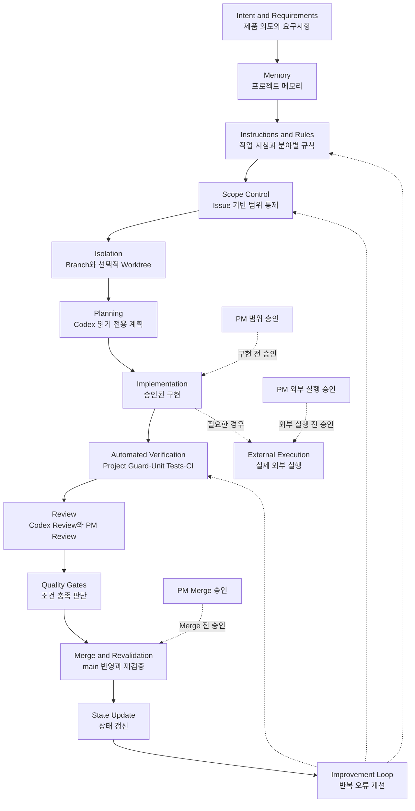
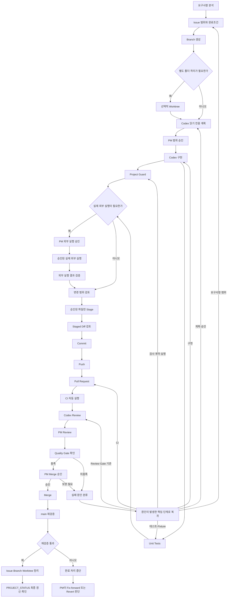

# Codex Engineering Harness Architecture

## 1. 문서 목적과 대상 독자

### 1.1 문서 목적

이 문서는 FreshManager의 Codex Engineering Harness 전체 구조와 구성요소의
관계를 정의한다. 또한 프로젝트 메모리, 작업 지침, 분야별 규칙, 작업 기록,
자동검사, 테스트, CI, 리뷰, 승인과 품질 게이트가 어떤 책임을 나누는지 설명한다.

이 문서는 개별 구성요소의 상세 내용을 다시 작성하지 않는다. 각 정보가 어느
문서에 있어야 하는지, 다른 문서에서는 어느 수준까지 요약할 수 있는지와 실패가
어떻게 다음 시스템 개선으로 이어지는지를 공식 설계 기준으로 제공한다.

이 문서는 `main`에 병합된 시점부터 FreshManager Codex Engineering Harness의
공식 Architecture 기준으로 사용한다.

### 1.2 대상 독자

- 제품 목표와 작업 범위를 승인하는 PM
- 저장소에서 계획·구현·검토를 수행하는 Codex
- 코드와 문서를 구현하는 개발자
- 변경 범위와 품질 증거를 확인하는 리뷰어
- 프로젝트 상태를 복원해야 하는 새로운 AI 세션
- 프로젝트를 처음 확인하는 협업자

### 1.3 이 문서가 설명하는 것

- Codex Engineering Harness의 계층과 구성요소 관계
- 사람과 Codex, 자동화의 책임 분담
- 현재 구현과 목표 구조의 차이
- 작업 시작부터 Merge와 상태 갱신까지의 생명주기
- 문서별 공식 책임과 중복 방지 원칙
- 실패 결과를 규칙·검사·테스트·템플릿 개선으로 전환하는 흐름

이 문서가 설명하지 않는 세부사항은 3.2절의 비목적에서 구분한다.

---

## 2. Codex Engineering Harness 정의

### 2.1 Codex Engineering Harness

Codex Engineering Harness는 Codex가 프로젝트 상태를 이해하고, 승인된 작업
범위 안에서 작업하고, 검증 결과를 피드백받아 수정하며, PM 승인 후 결과를 공식
상태에 반영하도록 설계한 전체 개발 운영 시스템이다.

다음 구성요소 전체가 Codex Engineering Harness에 포함된다.

- 프로젝트 메모리
- 작업 지침과 분야별 Rules
- 요구사항과 Issue 기반 범위 통제
- Branch와 선택적 Worktree 격리
- Codex 읽기 전용 계획
- PM Approval
- 구현
- Project Guard
- Unit Tests
- CI
- Codex Review
- PM Review
- Quality Gates
- Merge와 `main` 재검증
- 상태 갱신
- 반복 오류 개선 루프

Codex Engineering Harness는 자동검사 스크립트 하나를 뜻하지 않는다.

### 2.2 Project Guard

Project Guard는 저장소의 파일, 데이터, 문서, 보안 및 정책 규칙을 기계적으로
검사하는 Codex Engineering Harness의 자동검사 하위 시스템이다.

Project Guard는 단일 Python 스크립트와 같은 의미가 아니다. 검사 기준, 실행
구현체와 결과 보고 형식이 실제 Project Guard 실행 구성을 이룬다. 검사 구현을
검증하는 Unit Tests와 Fixtures는 Project Guard를 보증하는 별도 계층이며 정상
Project Guard 실행 경로에 포함되는 정책 검사가 아니다. CI는 Project Guard를
호출하는 별도의 자동 실행 환경이며 Project Guard 내부 구성요소로 합치지 않는다.

### 2.3 Unit Tests

Unit Tests는 코드 또는 검사 로직의 개별 동작이 예상한 결과를 내는지 검증하는
테스트다. 현재 저장소의 Unit Tests는 주로 Project Guard 검사 로직, 검사 ID
정합성, 종료코드, 실패 fixture 처리, 보안과 공식 파일 불변성을 검증한다.

향후 제품 코드가 구현되면 API 호출 준비, 응답 처리와 저장 로직의 Unit Tests가
추가될 수 있다. 이는 목표 예시이며 현재 구현된 테스트로 간주하지 않는다.

### 2.4 CI

CI(Continuous Integration, 지속적 통합 검증)는 Project Guard와 Unit Tests를
Pull Request 및 `main` 변경 시 GitHub의 독립된 환경에서 자동 실행하는 체계다.

CI는 PM Approval, PM Review, Merge 판단, 실제 서울시 API 호출, 서비스 배포와
CD(Continuous Delivery/Deployment)를 대신하지 않는다. 이 저장소의 현재 CI는
검증 자동화이며 배포가 아니다.

### 2.5 Quality Gates

Quality Gates는 Project Guard, Unit Tests, CI, Codex Review, PM Review와 해당
Gate 확인 시점까지 이미 요구된 선행 승인 기록을 종합하여 다음 행동의 조건이
충족됐는지를 판단하는 기준이다. 다음 행동 자체를 허가하는 PM Approval은 해당
Quality Gate 확인과 구분한다. Project Guard 성공만으로 Quality Gate가 자동
통과되지는 않는다.

### 2.6 PM Approval

PM Approval은 제품 목표, 작업 범위, 우선순위와 위험 수용 여부에 대한 명시적인
인간 승인이다. 승인 목적에 따라 다음 세 종류를 구분한다.

- 범위 승인: 구현 전 계획, 수정 허용 파일, 완료조건과 제외 범위를 확정한다.
- 외부 실행 승인: 실제 API 호출, Secret 사용 또는 외부 시스템에 영향을 주는
  실행을 별도로 허가한다. 범위 승인이 외부 실행 승인까지 자동 포함하지 않는다.
- Merge 승인: Review와 Quality Gate 확인 결과를 바탕으로 Pull Request의 `main`
  반영을 최종 허가한다.

PM Review는 증거와 위험을 검토하는 활동이고, Quality Gate 확인은 정해진 조건의
충족 여부를 판단하는 활동이며, PM Approval은 다음 행동을 허가하는 명시적
결정이다. 셋은 서로의 대체물이 아니다. Codex는 계획, 구현과 기술검토를
지원하지만 어느 PM Approval도 대체하지 않는다.

외부 실행이 필요 없는 대다수 작업(현재 이 프로젝트의 절대다수)에서는
범위 승인과 Merge 승인을 중심으로 한 두 단계 리듬으로 실무를 운용한다.
이 실무 리듬과 여러 Checklist 항목을 하나의 Integration PR로 묶어 승인
"횟수"를 줄이는(승인 "요건"은 줄이지 않는) 구체 절차는
`docs/engineering/DEVELOPMENT_WORKFLOW.md`가 정의한다. 외부 실행 승인은
그 문서가 정의하는 원칙대로 항상 실행 직전 별도로 받으며, 이 절이 정의한
세 종류 PM Approval의 구분 자체는 바뀌지 않는다.

---

## 3. 해결하려는 문제와 비목적

### 3.1 해결하려는 문제

Codex Engineering Harness는 다음 문제를 줄이기 위해 설계한다.

- 새 AI 세션이 이전 작업 상태와 결정 근거를 잃는 문제
- 승인된 파일과 완료조건을 벗어나 구현 범위가 확대되는 문제
- 여러 문서가 같은 정보의 서로 다른 사본을 보유해 충돌하는 문제
- 자동검사 하위 시스템과 전체 Harness를 같은 개념으로 표현하는 문제
- 검사, 기술 리뷰 또는 PM 승인이 누락된 상태에서 다음 단계로 이동하는 문제
- 로컬 실행 결과와 GitHub CI 환경의 결과가 달라지는 문제
- 반복되는 오류가 일회성 수정으로 끝나고 규칙이나 테스트에 남지 않는 문제

### 3.2 비목적

이 Architecture 문서의 직접 목적은 다음이 아니다.

- 45개 검사 ID 전체 명세와 개별 PASS·FAIL 조건 정의
- 현재 Issue, Pull Request와 Branch 상태 관리
- 터미널 명령 모음 제공
- EG-4 기능 또는 데이터 수집기 구현
- 서비스 배포나 CD 설계
- 실제 서울시 API 호출
- API Key 또는 실제 `.env` 값 공개
- 모든 `docs/rules/` 문서 전문 복사
- 일시적인 검사 집계와 실행 결과 기록

개별 자동검사 기준은 현재 공식 명세가, 현재 작업 상태는 프로젝트 상태 문서와
GitHub 기록이 각각 담당한다.

---

## 4. 설계 원칙

### 4.1 단일 소유권

하나의 정보 유형에는 하나의 공식 소유 문서만 둔다. 다른 문서는 상세 내용을
복사하지 않고 짧은 요약과 공식 소유 문서 링크를 사용한다.

### 4.2 최소 권한과 승인 범위

Codex, CI와 사람이 사용하는 권한은 작업 목적에 필요한 최소 범위로 제한한다.
파일 변경, 실제 API 호출, 패키지 설치와 Merge는 승인된 범위를 넘지 않는다.

### 4.3 사실과 계획의 분리

현재 존재하는 파일과 동작은 Current State로, 아직 구현되지 않은 이름과 구조는
Target State로 기록한다. 목표 경로를 현재 존재하는 공식 경로처럼 표현하지 않는다.

### 4.4 현재 상태와 영구 정책의 분리

현재 Issue, Branch와 다음 행동은 프로젝트 상태 문서가 담당한다. 장기간 유지되는
행동 규칙, 분야별 정책과 Architecture는 별도의 공식 문서가 담당한다.

### 4.5 증거 기반 단계 진행

구현 완료 주장은 변경 내용, Project Guard, Unit Tests, CI와 Review 결과처럼
재확인 가능한 증거에 연결한다. 자동검사 결과와 사람의 승인을 구분한다.

### 4.6 실패 결과의 재사용

실패는 단순히 해당 변경을 고치는 데서 끝내지 않는다. 반복 가능성이 있으면
적절한 rule, Project Guard 검사, Unit Test, 템플릿 또는 Skill 개선 후보로 남긴다.

### 4.7 최종 인간 승인

자동화와 Codex Review가 통과해도 제품 범위와 위험 수용, 단계 전환과 Merge의
최종 결정은 PM이 수행한다.

### 4.8 계층 분리

- Project Guard와 Quality Gate를 같은 의미로 사용하지 않는다.
- CI와 배포를 같은 의미로 사용하지 않는다.
- Unit Tests와 정책 검사를 같은 책임으로 합치지 않는다.
- Review와 자동검사를 서로 대체하지 않는다.

---

## 5. 전체 시스템 구성

### 5.1 개념 계층

Codex Engineering Harness는 다음 계층을 연결한다. 영문 명칭은 다른 개발
환경과의 대응을 돕기 위한 것이며 한국어 책임이 공식 설명이다.

| 계층 | 한국어 책임 |
|---|---|
| Intent and Requirements | 제품 의도와 요구사항 |
| Memory | 현재 상태와 변경 이력 복원 |
| Instructions and Rules | Codex 행동과 분야별 영구 정책 |
| Scope Control | Issue 기반 허용 범위와 완료조건 통제 |
| Isolation | Branch와 선택적 Worktree 격리 |
| Planning | Codex 읽기 전용 분석과 구현계획 |
| Approval Checkpoints | PM의 범위·외부 실행·Merge 승인 지점 |
| Implementation | 승인된 최소 변경 구현 |
| Automated Verification | Project Guard, Unit Tests와 CI 검증 |
| Review | Codex와 PM의 의미·범위·위험 검토 |
| Quality Gates | 증거를 종합한 단계 진행 판단 |
| Merge and Revalidation | `main` 반영과 공식 기준 재검증 |
| State Update | 현재 상태와 다음 행동 갱신 |
| Improvement Loop | 반복 오류의 시스템 개선 전환 |

아래 첫 번째 Mermaid는 시간순 작업 절차가 아니라 구성요소의 계층과 관계를
나타내는 **구성요소 관계도**다. 실제 작업 순서는 10장의 작업 생명주기에서
별도로 정의한다.



이 구성도의 실선은 구성요소의 주 관계이며 시간순 세부 절차는 아니다. PM 범위
승인, PM 외부 실행 승인과 PM Merge 승인은 주 흐름 안의 단일 순차 단계가 아니라
각 적용 지점을 통제하는 Checkpoint로 점선 표시한다. 범위 승인 없이는 구현하지
않고, 외부 실행이 필요한 경우에는 별도 외부 실행 승인을 받으며, Quality Gate
확인만으로 Merge 권한이 발생하지 않으므로 PM Merge 승인 후에만 Merge한다.
자동검사는 전체 Harness의 일부이며 세부 실행·보증 관계는 11장에서 구분한다.

### 5.2 Current State

현재 저장소는 자동검사 하위 시스템에 `Project Guard`라는 이름을 사용한다. 다음
표는 Project Guard 실행 구성, 이를 보증하는 Unit Tests·Fixtures와 Project Guard를
호출하는 외부 CI 연결을 구분해 보여준다.

| 역할 | 현재 경로 또는 구성 | 현재 책임 |
|---|---|---|
| Project Guard 실행 기준 | [`docs/testing/PROJECT_GUARD_SPEC.md`](../testing/PROJECT_GUARD_SPEC.md) | 검사 ID, 판정 조건, 상태와 종료코드의 유일한 기준 |
| Project Guard 실행 구현체 | [`scripts/project_guard_check.py`](../../scripts/project_guard_check.py) | 등록된 검사를 순서대로 실행하고 결과와 종료코드 생성 |
| Project Guard 결과 보고 형식 | [`docs/testing/PROJECT_GUARD_REPORT_TEMPLATE.md`](../testing/PROJECT_GUARD_REPORT_TEMPLATE.md) | 검사 결과, 위험과 PM 확인사항 기록 형식 |
| Project Guard 보증 Unit Tests | [`tests/test_project_guard_check.py`](../../tests/test_project_guard_check.py) | 검사 로직, 정합성, 실패 처리와 불변성 검증 |
| Project Guard 보증 Fixtures | [`tests/fixtures/`](../../tests/fixtures/) | 오류 경로를 재현하는 CSV·JSON fixture |
| 외부 CI 연결 | [`.github/workflows/ci.yml`](../../.github/workflows/ci.yml) | Project Guard 외부에서 PR와 `main` 변경의 검사를 자동 실행 |

현재 저장소 전용 Skill은 없다. Git, 선택적 Worktree, Python과 GitHub Actions가
현재 확인되는 주요 실행 수단이다.

### 5.3 현재 구현 상태

P3~P7에서 목표로 한 명칭과 경로 전환은 Pull Request, CI와 `main` 재검증까지
완료됐다.

| 목표 역할 | 목표 경로 또는 상태 | 현재 상태 |
|---|---|---|
| Project Guard 실행 스크립트 | `scripts/project_guard_check.py` | `main` 반영·검증 완료 |
| Project Guard 공식 명세 | `docs/testing/PROJECT_GUARD_SPEC.md` | 단일 공식 기준 전환 완료 |
| 통합 CI Workflow | `.github/workflows/ci.yml` | PR·`main` Push 실행 검증 완료 |
| 결과 보고 템플릿 | `docs/testing/PROJECT_GUARD_REPORT_TEMPLATE.md` | 이름 전환 완료 |
| 검사 Unit Test | `tests/test_project_guard_check.py` | 이름·import 전환과 회귀검증 완료 |

후속 변경도 Pull Request의 독립 CI 검증, PM Review와 Merge 후 `main` 재검증을
완료해야 공식 상태로 반영한다.

### 5.4 단일 공식 기준 원칙

현재 공식 자동검사 명세는
[`docs/testing/PROJECT_GUARD_SPEC.md`](../testing/PROJECT_GUARD_SPEC.md) 하나다.
이전 `docs/testing/HARNESS_SPEC.md`와 신·구 명세를 병존시키지 않는다.

### 5.5 Migration 이력

이 절은 P3~P7 명칭 전환의 추적 가능한 이력만 남긴 임시 Migration 기록이며
문서별 공식 책임표가 아니다.

| 역할 | 당시 경로 | 현재 공식 경로 | 구현 상태 |
|---|---|---|---|
| 검사 실행 스크립트 | `scripts/harness_check.py` | `scripts/project_guard_check.py` | `main` 전환 완료 |
| 검사 명세 | `docs/testing/HARNESS_SPEC.md` | `docs/testing/PROJECT_GUARD_SPEC.md` | 단일 공식 기준 전환 완료 |
| CI Workflow | `.github/workflows/harness.yml` | `.github/workflows/ci.yml` | Trigger를 유지해 전환·검증 완료 |
| 결과 보고 템플릿 | `docs/testing/HARNESS_REPORT_TEMPLATE.md` | `docs/testing/PROJECT_GUARD_REPORT_TEMPLATE.md` | 전환 완료 |
| 검사 Unit Test | `tests/test_harness_check.py` | `tests/test_project_guard_check.py` | 이름·import 전환 완료 |

---

## 6. 프로젝트 메모리와 정보 우선순위

### 6.1 프로젝트 메모리 구성

| 구성 | 메모리 역할 |
|---|---|
| README | 프로젝트 소개, 핵심 범위 요약과 시작 안내 |
| PROJECT_STATUS | 현재 완료 상태, 작업, 최근 이력과 다음 행동 |
| PRD | 제품 문제·대상 사용자·범위·요구사항·수용 기준 |
| TRD | 현재 구현과 목표 기술 구조·데이터·보안·검증 계약 |
| Cloud Backup and CSV Plan | Google Drive 백업·상태·복구와 첫 Batch 이후 CSV 목표 계약 |
| AGENTS | Codex가 새 세션에서 따라야 할 행동과 문서 진입점 |
| GitHub Issue | 단일 작업의 승인된 범위와 완료조건 |
| Pull Request | 실제 변경, 검증 결과, 위험과 승인 기록 |
| Git Commit | `main`에 반영된 변경의 추적 가능한 이력 |
| 작업일지 | 개인 관찰과 작업 경과를 위한 비공식 기록 |

PROJECT_STATUS는 상태 복원을 지원하지만 Git 기록이나 현재 Issue의 PM 확정
내용보다 상위의 절대 기준이 아니다. 작업일지와 과거 AI 대화도 공식 상태나
정책을 대신하지 않는다.

### 6.2 현재 정보 우선순위

현재 정보 우선순위는 [`AGENTS.md`](../../AGENTS.md)와
[`PROJECT_STATUS.md`](../../PROJECT_STATUS.md)에 같은 순서로 정의한다.

1. PM의 최신 명시적 지시와 승인·금지사항
2. 현재 `main` 코드와 실제 테스트 결과
3. 현재 Issue의 PM 승인 범위와 병합된 Pull Request
4. [`FreshManager_PRD_v1.0.md`](../product/FreshManager_PRD_v1.0.md)
5. [`FreshManager_TRD_v1.0.md`](../engineering/FreshManager_TRD_v1.0.md)
6. [`DATA_COLLECTION_RULES.md`](../rules/DATA_COLLECTION_RULES.md)
7. [`QUALITY_GATES.md`](../testing/QUALITY_GATES.md)
8. `AGENTS.md`
9. `PROJECT_STATUS.md`

이 순서에서 현재 코드와 테스트는 구현 사실을, Issue는 승인 범위를, 병합된 PR과
Commit은 변경 이력을 증명한다. PRD는 제품 목적을, TRD는 기술 계약을, AGENTS와
rules는 행동과 분야별 정책을 정의한다. Project Guard 명세는 검사 ID·판정·종료코드의
유일한 기준이고 Quality Gates는 단계 전환 기준이다.

정보 우선순위와 목표 문서 책임 모델 사이의 해석이 불분명해지면 Architecture에서
임의로 우선순위를 수정하지 않고 PM 승인 대상의 문서 정렬 작업으로 분리한다.

---

## 7. 작업 지침·Rules·Skills·도구

### 7.1 AGENTS

[`AGENTS.md`](../../AGENTS.md)는 Codex 작업 시작 순서, 필수 열람 문서, 행동 규칙,
금지사항, 검증·완료 보고 절차와 PM 승인 지점을 제공한다. Architecture는 그 행동
규칙을 복사하지 않고 전체 시스템에서 AGENTS가 차지하는 위치만 설명한다.

### 7.2 분야별 Rules

`docs/rules/`는 분야별 상세 정책을 소유한다.

- [`CODING_RULES.md`](../rules/CODING_RULES.md): 코드 구조, 오류처리와 테스트 정책
- [`GIT_WORKFLOW.md`](../rules/GIT_WORKFLOW.md): Issue, Branch, Worktree, PR와 Merge 절차
- [`SECURITY_RULES.md`](../rules/SECURITY_RULES.md): Secret, 로그, 데이터와 공유 보안
- [`DATA_COLLECTION_RULES.md`](../rules/DATA_COLLECTION_RULES.md): 데이터 요청·보존·변환 규칙

Architecture는 rules의 전문을 복사하지 않는다. rules가 서로 충돌하면 현재 정보
우선순위와 PM 승인 절차에 따라 별도 정렬 작업으로 해결한다.

### 7.3 Skills

Skill은 반복 업무를 재사용 가능한 절차로 패키징하는 확장 지점이다. 현재 저장소에는
저장소 전용 Skill이 없다. 향후 Skill 도입 가능성은 설계 확장점일 뿐 현재 기능이나
완료 상태로 표현하지 않는다.

### 7.4 도구

도구는 정책 자체가 아니라 승인된 작업을 수행하는 실행 수단이다. 현재 구조에서
Git은 이력 관리, Worktree는 선택적 폴더 격리, Python은 Project Guard와 Unit
Tests 실행, GitHub Actions는 CI 환경을 제공한다. 도구 사용은 AGENTS와 분야별
rules의 권한·보안·범위 제한을 따른다.

---

## 8. 요구사항과 Issue 기반 범위 통제

### 8.1 요구사항의 책임

요구사항은 제품이 무엇을 해결하고 어떤 범위와 수용 기준을 가지는지 정의한다.
FreshManager의 상위 제품 범위는
[`FreshManager_PRD_v1.0.md`](../product/FreshManager_PRD_v1.0.md)를 따른다. 기술 구조와
구현 계약은 [`FreshManager_TRD_v1.0.md`](../engineering/FreshManager_TRD_v1.0.md)가 PRD를 변환해
정의한다. `docs/history/requirements/requirements-definition-freshmanager-poc-v0.4.md`는 PRD 이전의 역사적
요구사항 기준선으로만 보존한다.

### 8.2 Issue의 책임

GitHub Issue는 하나의 작업에서 무엇을 변경할지 실행 범위를 고정한다. Issue에는
목적, 배경, 허용 파일, 금지 파일, 완료조건, 제외범위, 선행조건, 검증계획과 PM
결정사항을 기록한다. 현재 범용 형식은
[`task.md`](../../.github/ISSUE_TEMPLATE/task.md)를 사용한다.

요구사항이 제품 범위를 소유하고 Issue가 그중 한 번의 변경 범위를 소유한다.
Issue가 요구사항을 임의로 확대하거나 Architecture가 개별 Issue의 완료조건을
대신 정의하지 않는다.

### 8.3 읽기 전용 계획과 범위 변경

Codex는 구현 전에 현재 상태, 문서 충돌, 예상 변경, 검증과 위험을 읽기 전용으로
보고한다. PM이 계획을 승인하기 전에는 구현을 시작하지 않는다. 작업 중 범위를
넓혀야 하면 기존 Issue를 자동 확대하지 않고 이유, 영향, 선택지와 승인 이력을
Issue에 기록한다.

---

## 9. Branch·Worktree 기반 작업 격리

### 9.1 Branch

Branch는 모든 변경 작업에서 `main`과 작업 이력을 분리하는 기본 격리 단위다.
하나의 Branch는 하나의 Issue 또는 하나의 명확한 작업 목적을 다룬다. 승인되지
않은 파일이 섞이면 변경 범위 검토에서 분리하거나 작업을 중단한다.

### 9.2 Worktree

Worktree는 Branch를 별도의 실제 폴더에 펼쳐 물리적으로 격리하는 선택적 방식이다.
다음 경우에 사용을 고려한다.

- 여러 Branch를 동시에 작업할 때
- 장기 작업과 단기 작업을 분리할 때
- 파일 혼입 위험이 높을 때
- 별도 작업 폴더가 필요한 경우

모든 Issue에 Worktree를 요구하지 않는다. 단순 문서 변경이나 작은 단일 작업은
Branch만으로 충분할 수 있다. 자세한 선택과 정리 절차는
[`GIT_WORKFLOW.md`](../rules/GIT_WORKFLOW.md)를 따른다.

여러 Checklist 항목을 병렬로 다루는 Parent Issue에서 Worktree로 격리한
Worker Branch들을 하나의 Integration Branch로 모아 단일 Integration PR로
`main`에 반영하는 절차는 [`DEVELOPMENT_WORKFLOW.md`](../engineering/DEVELOPMENT_WORKFLOW.md)가
정의한다.

---

## 10. Human-in-the-loop 작업 생명주기

Human-in-the-loop는 자동화 사이에 사람의 판단과 승인을 명시적으로 포함하는
운영 방식이다. FreshManager의 기본 생명주기는 다음과 같다.

```text
요구사항 분석
→ Issue 생성
→ Branch 생성
→ 필요 시 Worktree
→ Codex 읽기 전용 계획
→ PM 범위 승인
→ Codex 구현
→ Project Guard
→ Unit Tests
→ 외부 실행 필요 시 PM 외부 실행 승인
→ 승인된 외부 실행
→ 외부 실행 결과 검증
→ 변경 범위 검토
→ 승인된 파일만 Stage
→ Staged Diff 검토
→ Commit
→ Push
→ Pull Request
→ CI
→ Codex Review
→ PM Review
→ Quality Gate 확인
→ PM Merge 승인
→ Merge
→ main 재검증
→ Issue·Branch·Worktree 정리
→ PROJECT_STATUS 최종 갱신·확인
```



이 흐름에서 Worktree는 선택적이다. Project Guard와 Unit Tests의 통과는 검증
증거를 제공하지만, PM Review, Quality Gate 확인과 PM Merge 승인을 건너뛰게 하지
않는다. Stage는 승인된 파일을 Commit 후보로 올리는 단계이며 Staged Diff 검토는
그 후보가 Issue 범위와 정확히 일치하는지 확인하는 단계다. Commit은 검토된 변경을
추적 가능한 이력으로 기록하고 Push는 그 이력을 원격 Branch에 전송하므로 두
단계를 합치지 않는다.

외부 실행 결과 검증은 승인된 대상과 횟수, 응답 또는 실행 결과, 생성된 파일 범위,
데이터 보존과 Secret 비노출을 확인한다. 외부 실행이 필요하지 않은 작업은 이
조건부 경로를 거치지 않고 Project Guard·Unit Tests 이후 변경 범위 검토로 간다.

이 생명주기의 마지막 상태 갱신은 Merge와 정리 후 수행하는 최종 갱신·확인을
의미한다. P10에서 별도 정책이 확정되기 전까지 Issue 시작, Branch 생성, PM 결정,
구현 완료, PR 생성, Gate 변경 또는 새로운 위험 확인 등 중간 시점의 갱신은
[`PROJECT_STATUS.md`](../../PROJECT_STATUS.md)의 현행 갱신 규칙을 따른다.

실패는 무조건 구현 단계로 돌아가지 않는다. 요구사항·범위 문제는 Issue와 범위
승인으로, 검사 계약 문제는 Project Guard 명세나 실행 구성으로, 테스트 문제는
Unit Tests·Fixtures로, CI 문제는 Workflow와 PR 단계로 돌아간다. 반복 원인은
14장의 개선 루프로 전환한다. `main` 재검증 실패 처리는 13장의 별도 원칙을 따른다.

---

## 11. 검증 계층

### 11.1 Project Guard 실행 구성

현재 Project Guard의 실제 실행 경로는 다음 책임을 분리한다.

| 구성 | 책임 |
|---|---|
| 현재 공식 명세 | 검사 항목, ID, 상태, 조건과 종료코드 정의 |
| 실행 구현체 | 저장소를 읽고 검사를 실행해 증거와 결과 생성 |
| 결과 보고 형식 | 실행 환경, 상태 집계, 실패·위험과 PM 확인사항 기록 |

Project Guard는 파일과 정책 위반을 발견하고 상태를 반환한다. 제품 목적 달성,
위험 수용과 다음 단계 진입을 단독으로 판단하지 않는다.

### 11.2 Project Guard 보증 구성

Project Guard 실행 구성 자체가 올바른지는 다음 별도 구성으로 보증한다.

| 구성 | 책임 |
|---|---|
| Project Guard Unit Tests | 검사 로직 자체가 정상·실패 입력에서 계약대로 동작하는지 검증 |
| Fixtures | 공식 데이터와 분리된 재현 가능한 정상·오류 입력 제공 |

Unit Tests와 Fixtures는 Project Guard의 신뢰성을 보증하지만 정상 Project Guard
실행 시 저장소 정책을 직접 판정하는 실행 단계는 아니다. Fixture는 테스트 입력일
뿐 공식 CSV·JSON이나 실제 수집 데이터의 대체 기준이 아니다.

### 11.3 Unit Tests의 현재 역할

현재 Unit Tests는 주로 Project Guard 구현체를 검증한다.

- 검사 로직의 정상·실패 판정
- 검사 ID와 명세 순서 정합성
- 종료코드 계약
- 실패 fixture 처리
- 민감정보 비출력과 네트워크 차단
- 공식 파일 불변성

### 11.4 Unit Tests의 향후 역할

EG-4 이후 제품 코드가 생기면 API 요청 준비, 응답 검증, 원본 저장과 메타데이터
기록 같은 개별 로직의 Unit Tests가 추가될 수 있다. 현재 존재하는 테스트로
표현하지 않으며 해당 구현 Issue에서 범위와 fixture를 승인받는다.

### 11.5 CI의 현재 역할

현재 CI는 [`.github/workflows/ci.yml`](../../.github/workflows/ci.yml)을
통해 `main` 대상 Pull Request와 `main` Push에서 Project Guard와 Unit Tests를
실행한다. CI 환경은 로컬과 다른 독립 실행 증거를 제공한다.

CI에는 실제 서울시 API 호출, 실제 API Key 사용, 배포와 CD가 포함되지 않는다.

### 11.6 검증 계층 구분

| 계층 | 질문 | 산출물 |
|---|---|---|
| Project Guard | 저장소 정책과 파일·데이터 계약을 지켰는가 | 기계적 검사 결과 |
| Unit Tests | 개별 코드와 검사 로직이 예상대로 동작하는가 | 테스트 성공·실패 |
| CI | GitHub 독립 환경에서도 검사가 재현되는가 | 자동 실행 상태와 로그 |
| Codex Review | 의미, 범위, 위험과 문서 정합성이 적절한가 | 기술 검토 결과 |
| PM Review | 사용자 목적, 제품 범위와 위험을 어떻게 판단하는가 | 인간 검토 결과 |
| Quality Gate 확인 | 정의된 필수 증거와 조건이 충족됐는가 | 조건 충족 판단 |
| PM Approval | 범위·외부 실행·Merge 중 해당 행동을 허가하는가 | 명시적 인간 승인 |

---

## 12. Review·Quality Gate 확인·PM Approval

### 12.1 Codex Review

Codex Review는 자동검사가 다루기 어려운 요구사항 해석, 범위 밖 변경, 데이터
손실 가능성, 예외처리, 테스트 누락과 문서·코드 불일치를 검토한다. Codex는
기술적 판단 근거와 위험을 제시하지만 PM의 제품 결정을 대신하지 않는다.

### 12.2 PM Review

PM Review는 작업 목적 달성, 제품 범위, 완료조건, 남은 위험, 다음 단계 필요성과
Merge 여부를 검토한다. Review 결과는 승인 판단의 근거지만 Review 수행 자체가
승인을 뜻하지 않는다. Pull Request는 이 검토에 필요한 실제 변경과 검증
증거를 제공하며 현재 형식은
[`pull_request_template.md`](../../.github/pull_request_template.md)를 따른다.

### 12.3 Quality Gate 확인

[`QUALITY_GATES.md`](../testing/QUALITY_GATES.md)는 단계별 진입·통과와 다음
단계 판단 기준을 소유한다. Quality Gate 확인은 다음 증거와 선행 승인 기록이
정해진 조건을 충족하는지 판단한다.

- 승인된 Issue 범위와 완료조건
- Project Guard 결과
- Unit Tests 결과
- CI 결과
- 변경 범위와 보안 검토
- Codex Review
- PM Review
- 해당 단계가 요구하는 범위 승인과 외부 실행 승인 기록

선행 승인 기록은 해당 Gate 확인 전에 이미 완료돼야 하는 승인만 뜻한다. 현재
Gate 확인 후 수행할 행동을 허가하는 승인은 그 Gate의 선행 증거로 계산하지
않는다. 특히 PM Merge 승인은 Merge 전 Quality Gate 확인 이후 수행한다. Quality
Gate 확인은 조건 충족 판단이며 행동 허가가 아니다.

Project Guard나 CI 하나의 성공을 Quality Gate 전체 통과와 같은 의미로 표현하지
않는다. Quality Gate 조건이 충족돼도 Merge 권한이 자동 발생하지 않으며, 검사
실패가 없더라도 필요한 PM Approval이나 제품 완료조건이 남아 있으면 다음 행동을
진행하지 않는다.

### 12.4 PM Approval

PM Approval은 Review나 Gate 확인 결과를 바탕으로 특정 행동을 허가한다. 구현 전
범위 승인, 실제 외부 시스템에 영향을 주기 전 외부 실행 승인, `main` 반영 전
Merge 승인을 구분해 기록한다. 한 종류의 승인을 다른 종류의 승인으로 확대
해석하지 않는다.

### 12.5 Quality Gates와 FreshManager Engineering Gates

Quality Gates는 증거를 종합해 단계 진행 가능 여부를 판단하는 상위 운영 개념이다.
FreshManager Engineering Gates인 EG-0~EG-8은 이 개념을 현재 프로젝트의 단계별
준비도와 실행 순서에 적용한 구체적인 Gate 체계다. 각 EG의 진입·통과·다음 단계
조건은 [`QUALITY_GATES.md`](../testing/QUALITY_GATES.md)가 소유한다.

Engineering Gate는 프로젝트의 단계이고, Quality Gate 확인은 해당 단계의 진입·
통과 조건이 충족됐는지를 판단하는 활동이다. Project Guard나 CI의 성공은 그
판단에 사용하는 일부 증거다. Gate 확인 이후의 다음 행동은 별도로 요구되는 PM
Approval까지 완료돼야 실행할 수 있으며, Gate 확인과 PM Approval을 같은 행위로
표현하지 않는다. EG 하나의 조건 충족이 모든 후속 EG나 제품 전체 완료를 뜻하지
않는다. 데이터 PoC 판단용 Gate A·B·C는 분석 가치와 사용자 가치를 판단하는 별도
체계이며 EG-0~EG-8과 혼용하지 않는다. Recommendation MVP Workstream은
`PLANNED`, Gate number `NOT_ASSIGNED`이며 별도 PM 승인 전 공식 Gate가 아니다.

---

## 13. Merge·main 재검증·정리·상태 갱신

### 13.1 Merge 전

Pull Request는 연결 Issue, 변경 파일, 검증 증거, 미실행 검사, 보안 결과,
범위 외 작업과 남은 위험을 기록한다. 적용 Quality Gate 확인과 PM Merge 승인이
충족된 후에만 `main` 반영을 진행한다.

### 13.2 Merge와 main 재검증

Merge는 승인된 변경을 공식 기준인 `main`에 반영한다. CI의 `main` 검증은
병합된 상태에서도 Project Guard와 Unit Tests가 재현되는지 확인한다. 이 재검증은
배포 또는 실제 API 실행이 아니다.

### 13.3 main 재검증 실패 대응

`main` 재검증이 실패하면 Issue 완료, Branch·Worktree 정리와 완료 상태 갱신을
중단한다. 실패 증거와 영향 범위를 보존하고 PM이 다음 중 하나를 판단한다.

- Fix-forward: 새 수정 Issue와 Pull Request로 원인을 바로잡아 `main`을 다시
  검증한다.
- Revert: 영향이 크거나 안전한 수정에 시간이 필요한 경우, Git 이력을 보존하는
  되돌림 변경을 별도 승인·검토해 적용한다.

Codex나 CI가 자동으로 Revert를 선택하거나 파괴적인 Git 명령으로 이력을
지우지 않는다. PM 결정과 후속 검증이 끝나기 전에는 해당 작업을 완료로 기록하지
않는다.

### 13.4 정리

Merge와 재검증 후 연결 Issue 상태, 원격·로컬 Branch와 사용한 Worktree를
확인한다. 정리는 변경 이력과 미추적 사용자 파일을 훼손하지 않는 범위에서
PM이 승인한 Git 절차를 따른다.

### 13.5 상태 갱신

Merge와 정리 후 [`PROJECT_STATUS.md`](../../PROJECT_STATUS.md)의 완료된 최근
작업, 현재 작업, 다음 행동과 남은 위험을 최종 갱신·확인한다. 중간 갱신은 현행
PROJECT_STATUS 갱신 규칙을 유지하며, Architecture에서 새로운 갱신 주기를
확정하지 않는다. 정책 변경 여부는 P10에서 PM 승인 후 결정한다. Architecture,
rules와 검사 명세에는 일시적인 Issue·Branch·실행 집계를 기록하지 않는다.

---

## 14. 실패 피드백과 반복 오류 개선 루프

### 14.1 기본 흐름

```text
문제 발견
→ 일회성 또는 반복성 판단
→ 원인 분류
→ 원인이 발생한 책임 단계로 복귀
→ 규칙·검사·테스트·템플릿·Skill 개선
→ 재검증
→ 다음 작업에서 재사용
```

일회성 입력 오류는 해당 Issue에서 고칠 수 있다. 같은 유형이 반복되거나 다른
작업에도 영향을 주면 재현 가능한 시스템 개선으로 전환한다. 실패를 발견한 단계와
원인을 만든 단계가 다를 수 있으므로 CI나 Review에서 발견한 문제도 무조건 구현
단계로 보내지 않는다.

### 14.2 문제 유형별 개선 위치

| 문제 유형 | 우선 개선 위치 |
|---|---|
| 요구사항 또는 수용 기준의 모호성 | 요구사항 정의서와 Issue |
| Codex 행동 순서 누락 | AGENTS |
| 개인정보·Secret·보안 정책 위반 | `docs/rules/` |
| 승인 범위 확대 | Issue 템플릿과 범위 승인 절차 |
| 외부 실행 승인 누락 | PM 외부 실행 승인 절차 |
| 개별 기능 오류 | Unit Tests |
| Project Guard 검사 계약·실행 오류 | Project Guard 명세와 실행 구성 |
| Project Guard 테스트 입력·판정 오류 | Unit Tests와 Fixtures |
| CI 환경·Trigger 오류 | CI Workflow와 Pull Request |
| 단계 판단 혼선 | QUALITY_GATES |
| 상태 복원 오류 | PROJECT_STATUS |
| `main` 재검증 실패 | PM의 Fix-forward 또는 Revert 판단 |
| 반복 가능한 작업 절차 | 향후 Skill |

### 14.3 개선 변경의 통제

반복 오류를 발견했다고 현재 작업 범위를 자동 확대하지 않는다. 새 검사, 테스트,
rule 또는 템플릿 변경이 필요하면 별도 Issue와 PM 승인을 통해 진행한다.
H-001~H-004 변경이나 새 검사 확정은 이 Architecture 작성 범위가 아니며,
Project Guard 로직 보강은 P12 후속 검토 대상으로 남긴다.

---

## 15. 문서별 공식 책임과 중복 방지 원칙

### 15.1 현재 책임 정렬 상태

PRD·TRD를 공식 기준으로 연결하고 다음 중복 방지 원칙을 적용한다. 아래 항목은
완료 상태를 과장하지 않기 위해 계속 관리할 문서 부채와 회귀 위험이다.

- 프로젝트 소개와 목표가 README, AGENTS와 PROJECT_STATUS에 반복된다.
- 현재 상태와 Gate 상태가 여러 문서에 반복된다.
- Codex 행동 절차가 AGENTS, Git 규칙과 상태 문서에 중복된다.
- 자동검사 부분과 전체 Codex Engineering Harness에 같은 Harness 용어가 사용된다.
- 자동검사 통과와 Quality Gate 통과가 같은 완료 의미로 읽힐 수 있다.
- Merge 판단 조건과 Git 실행 절차가 여러 문서에 반복된다.

다음 책임표는 현행 공식 책임 모델이다. 문서 내용이나 경로가 바뀌면 소유 문서와
참조 문서를 같은 변경에서 정렬한다.

### 15.2 목표 문서 책임 모델

| 정보 유형 | 공식 기준 문서 | 다른 문서에서 허용되는 요약 | 금지되는 상세 중복 | 갱신 시점 | 책임 주체 |
|---|---|---|---|---|---|
| 제품 문제·대상 사용자·상세 포함·제외 범위·요구사항·수용 기준 | [`FreshManager_PRD_v1.0.md`](../product/FreshManager_PRD_v1.0.md) | README의 핵심 요약과 Issue의 작업 관련 발췌 | 제품 요구사항 상세를 Architecture·상태 문서에 재정의 | 제품 문제·범위·요구사항·수용 기준 변경 시 | PM |
| 현재 구현과 목표 기술 구조·인터페이스·데이터·보안·검증 계약 | [`FreshManager_TRD_v1.0.md`](../engineering/FreshManager_TRD_v1.0.md) | Rules·Issue·PR의 관련 기술 계약 링크 | 제품 목적을 TRD에서 재정의하거나 미래 목표를 구현 완료로 표현 | 구현 또는 목표 기술 계약 변경 시 | 구현자, PM 승인 |
| PRD 이전 요구사항 이력 | [`requirements-definition-freshmanager-poc-v0.4.md`](../history/requirements/requirements-definition-freshmanager-poc-v0.4.md) | PRD 근거 자료에서 역사 문서로 참조 | 현행 수집 순서·운영 승인 기준으로 사용 | 역사적 근거 보정 시 | PM |
| 프로젝트 소개·목표와 범위의 핵심 요약·시작 안내·주요 문서 링크 | [`README.md`](../../README.md) | 프로젝트 한 줄 소개와 README 링크 | 요구사항 정의서의 상세 포함·제외 범위와 수용 기준 반복 | 소개·핵심 요약·진입점 변경 시 | PM 승인, Codex 반영 |
| 현재 상태·현재 작업·최근 이력·다음 행동 | [`PROJECT_STATUS.md`](../../PROJECT_STATUS.md) | 현재 단계 한 줄과 상태 문서 링크 | 일시적 Issue·Branch·실행 결과 표 | 현행 PROJECT_STATUS 갱신 규칙을 따르며 구체적 체크포인트는 P10에서 재검토 | Codex 초안, PM 확인 |
| 장기 제품 맥락과 안정적 원칙 | [`PROJECT_MEMORY.md`](../../ai-context/PROJECT_MEMORY.md) | 새 세션 복원용 요약과 정본 링크 | 현재 Branch·HEAD·Issue 상태 또는 PRD·TRD 요구사항 복제 | 장기 목표·핵심 경계 변경 시 | Codex 초안, PM 확인 |
| 승인된 제품·운영 결정 이력 | [`DECISION_LOG.md`](../../ai-context/DECISION_LOG.md) | 관련 Decision 링크 | 확인되지 않은 날짜·승인·완료 상태 추정 | PM 결정 또는 기존 결정의 폐기·대체 시 | PM 결정, Codex 기록 |
| 기술 구조 결정과 대안·영향 | [`ARCHITECTURE_DECISIONS.md`](../../ai-context/ARCHITECTURE_DECISIONS.md) | 관련 ADR 링크 | PRD·TRD 또는 현재 상태의 대체 서술 | Architecture 결정·대안·영향 변경 시 | 구현자 초안, PM 승인 |
| Codex 시작 순서·행동 규칙·금지사항·PM 승인 지점 | [`AGENTS.md`](../../AGENTS.md) | Architecture에서 역할과 진입점만 설명 | 상세 시작 순서·금지사항 복사 | 행동 정책 또는 승인 지점 변경 시 | PM |
| Harness 전체 구조·계층·관계·책임 모델·피드백 루프 | `docs/architecture/CODEX_HARNESS_ARCHITECTURE.md` | README·AGENTS의 한 문장과 링크 | 전체 계층·책임표·피드백 루프 재작성 | 구성요소·책임·전환 상태 변경 시 | Codex 유지, PM 승인 |
| 분야별 Rules | [`docs/rules/`](../rules/) | Architecture에서 문서별 역할과 링크 | 구현·Git·보안·수집 규칙 전문 복사 | 해당 분야 계약 변경 시 | 구현자와 PM |
| Google Drive 백업·CSV 목표 계약 | [`CLOUD_BACKUP_AND_CSV_MANAGEMENT_PLAN.md`](../data/CLOUD_BACKUP_AND_CSV_MANAGEMENT_PLAN.md) | PRD·TRD·Rules·Status의 역할별 요약과 링크 | 상태 전이·충돌·Receipt·CSV 순서를 여러 문서에서 재정의 | 제공자·목적지·Worker·CSV 계약 변경 시 | PM 승인, 구현자 반영 |
| Area·S-DoT·Spot Candidate·Recommendation 구조 | PRD 제품계약 + TRD 기술계약 | README·Panel·Analysis의 목적별 요약과 링크 | Spot을 고정 판매 위치로 표현하거나 S-DoT를 Area 대체값·필수 직렬 단계로 재정의 | Feature 구조·추천 정책·EG-8 또는 후속 Workstream 변경 시 | PM 승인, 구현자 반영 |
| Project Guard 검사 항목과 판정 | [`docs/testing/PROJECT_GUARD_SPEC.md`](../testing/PROJECT_GUARD_SPEC.md) | 검사 범주와 공식 명세 링크 | 개별 검사 ID·조건 전체 복사 | 검사·상태·종료코드 변경 시 | 구현자, PM 승인 |
| 단계 진입·통과·PR·Merge·Issue 종료 판단 | [`docs/testing/QUALITY_GATES.md`](../testing/QUALITY_GATES.md) | 현재 단계 이름과 공식 Gate 링크 | 단계별 조건 전체 복사 | 진입·통과·Merge·종료 기준 변경 시 | PM |
| 단일 작업 범위와 완료조건 | GitHub Issue ([템플릿](../../.github/ISSUE_TEMPLATE/task.md)) | PR의 Issue 연결과 목적 요약 | 승인된 Issue 본문 전체 복사 | 작업 생성·범위 변경 승인 시 | PM |
| 실제 변경과 검증 증거 | Pull Request ([템플릿](../../.github/pull_request_template.md)) | PROJECT_STATUS의 완료 한 줄과 PR 참조 | 영구 정책과 Architecture 원문 작성 | PR 생성·검증·리뷰 시 | 구현자, PM 최종 승인 |
| Git 변경 이력 | Git Commit | PR과 상태 문서의 Commit 참조 | 현재 상태나 요구사항을 Commit만으로 대체 | 승인된 변경을 추적 가능한 이력으로 기록할 때 | Commit 작성자 |
| 개인 작업일지 | 작업일지 | 공식 Issue로 승격된 결론만 인용 | 공식 상태·정책·승인 근거로 직접 사용 | 개인 필요 시 | 작성자 |
| Project Guard 결과 보고 형식 | [`PROJECT_GUARD_REPORT_TEMPLATE.md`](../testing/PROJECT_GUARD_REPORT_TEMPLATE.md) | PR의 상태 집계와 보고서 참조 | 검사별 결과표 전문 복사 | 결과 기록 형식 변경 시 | 실행자, PM 확인 |
| CI 자동 실행 정의 | [`.github/workflows/ci.yml`](../../.github/workflows/ci.yml) | README의 CI 존재 안내 | Workflow YAML과 일시 실행 로그 복사 | Trigger·환경·자동 실행 단계 변경 시 | 구현자, PM 승인 |

이 책임표에서 현재 Project Guard 공식 명세는 `PROJECT_GUARD_SPEC.md` 하나다.

### 15.3 문서 중복 방지 원칙

1. 하나의 정보 유형에는 하나의 공식 소유 문서만 둔다.
2. 다른 문서는 상세 복사 대신 짧은 요약과 링크를 사용한다.
3. 현재 상태와 영구 정책을 분리한다.
4. Architecture는 구성요소 관계를 설명하고 개별 검사 ID를 소유하지 않는다.
5. AGENTS는 실행 행동을 소유하고 Architecture 철학 전체를 복사하지 않는다.
6. README는 프로젝트 소개, 목표·범위의 핵심 요약과 문서 진입점을 담당하며,
   상세 제품 범위와 수용 기준은 요구사항 정의서가 담당한다.
7. PROJECT_STATUS는 현재 상태와 다음 행동을 담당한다.
8. Project Guard는 검사 증거를 생성하지만 Gate를 단독 통과시키지 않는다.
9. CI는 검사를 자동 실행하지만 PM Approval이나 배포를 대신하지 않는다.
10. Issue는 작업 범위를 소유한다.
11. Pull Request는 변경 및 검증 증거를 소유한다.
12. Commit은 추적 가능한 변경 이력을 소유한다.
13. 작업일지는 공식 상태나 정책을 대신하지 않는다.
14. 현재 이름과 목표 이름을 동시에 공식 기준으로 사용하지 않는다.
15. 공식 경로나 명령이 바뀌면 소유 문서와 참조 문서를 함께 갱신한다.

### 15.4 AI Context Restoration 읽기 순서

새 AI 세션은 다음 순서로 상태와 장기 맥락을 복원한다.

1. `AGENTS.md`
2. `PROJECT_STATUS.md`
3. `ai-context/PROJECT_MEMORY.md`
4. PRD
5. TRD
6. 현재 GitHub Issue와 Git 상태
7. 작업 관련 Rule·Quality·Data·Analysis 문서
8. `DECISION_LOG.md`의 관련 Decision
9. `ARCHITECTURE_DECISIONS.md`의 관련 ADR

`PROJECT_STATUS.md`가 현재 상태와 다음 행동의 공식 복원 문서다. `ai-context/`는
정본을 대체하지 않으며, 매 작업 종료 시 장기 맥락·승인 결정·Architecture에 미친
영향을 검토해 필요한 문서만 갱신한다.

---

## 16. FreshManager EG-4 적용 예시와 향후 확장

### 16.1 적용 예시의 목적

다음은 “FreshManager EG-4 — 서울시 API 최초 1회 호출 및 원본 응답 저장”이
Codex Engineering Harness 안에서 진행되는 방식을 설명하는 시나리오다. 실제
호출 또는 구현 완료 결과가 아니라 Architecture 이해를 위한 예시다.

### 16.2 예시 흐름

| 단계 | EG-4 설명용 시나리오 |
|---|---|
| 요구사항 | 여의도 데이터를 최초 1회 안전하게 수집하고 원본과 최소 메타데이터를 보존한다. |
| Issue 범위 | 1회 호출, 로컬 API Key 사용, 원본 저장, 메타데이터와 검증 완료조건을 확정한다. 반복수집과 121장소 수집은 제외한다. |
| Branch | EG-4 작업 이력을 `main`과 분리한다. 파일 혼입 위험이 높으면 Worktree를 선택한다. |
| Codex 계획 | 실제 호출 전 코드 구조, 보안, fixture 테스트, 수동 호출 분리와 실패 대응을 읽기 전용으로 보고한다. |
| PM 범위 승인 | EG-4 진입, 수정 파일, 완료조건과 제외 범위를 구현 전에 승인한다. |
| 구현 | API Key를 로컬 환경에서만 읽고, 여의도 요청을 준비하며, 원본 JSON과 승인된 최소 메타데이터를 별도로 저장한다. |
| Project Guard | Secret 노출, 공식 장소코드, 원본 불변, 메타데이터와 정책 위반을 검사한다. 실제 API 호출은 시작하지 않는다. |
| Unit Tests | 가짜 응답과 임시 파일로 요청 준비, 응답 처리와 저장 로직을 검증할 수 있다. 이러한 제품 코드 테스트는 향후 EG-4 작업에서 추가될 후보이며 현재 존재한다고 보지 않는다. |
| PM 외부 실행 승인 | 오프라인 검증 결과와 호출 대상·횟수·저장 경로·Secret 비노출 방법을 확인한 뒤 여의도 1회 호출을 별도로 승인한다. |
| 실제 외부 실행 | CI와 일반 Unit Tests에서 분리된 수동 절차로 승인된 여의도 1회만 호출하고, 원본 JSON과 최소 메타데이터를 저장한 뒤 API Key 및 API Key가 포함된 전체 요청 URL의 비노출을 확인한다. |
| 실행 후 검증 | 호출 횟수, 응답 구조, 원본 보존, 메타데이터, 로그 마스킹과 저장 파일 범위를 검토한다. 실제 Secret 값은 출력하거나 PR에 포함하지 않는다. |
| Stage·Staged Diff | 승인된 저장소 파일만 Stage하고 Staged Diff에서 `.env`, 실제 API Key, API Key가 포함된 요청 정보와 범위 밖 파일이 제외됐는지 확인한다. 실응답 원본과 메타데이터의 Git 추적 여부는 DATA_COLLECTION_RULES와 EG-4 Issue의 PM 결정에 따라 확인하며, 승인되지 않았다면 Stage하지 않는다. |
| Commit | Staged Diff 검토를 통과한 변경을 추적 가능한 이력으로 기록한다. |
| Push | Commit된 이력을 별도 단계로 원격 작업 Branch에 전송한다. |
| CI | Project Guard와 Unit Tests를 실행하며 실제 API Key, 실제 `.env`와 서울시 API를 사용하지 않는다. |
| Review | Codex는 코드·문서·보안·범위를 검토하고 PM Review는 목적, 위험과 실제 호출 결과를 검토한다. |
| EG-4 Quality Gate 확인 | 검사와 Review, 범위·외부 실행 승인, 원본·메타데이터 보존 증거가 EG-4 조건을 충족하는지 확인한다. |
| PM Merge 승인 | EG-4 Gate 확인 결과와 남은 위험을 바탕으로 `main` 반영을 별도로 승인한다. |
| Merge·재검증 | 승인된 변경만 `main`에 반영하고 CI로 다시 검증한다. |
| 상태 갱신 | 완료 이력, 남은 위험과 다음 행동을 PROJECT_STATUS에 기록한다. |

예시의 보안·데이터 제약은 다음과 같다.

- 여의도 데이터 최초 1회 호출만 다룬다.
- API Key는 로컬 환경에서만 사용하고 Git에 Commit하지 않는다.
- API Key 및 API Key가 포함된 전체 요청 URL을 로그, Issue, Pull Request 또는
  Commit에 노출하지 않는다.
- 원본 JSON을 변형하거나 덮어쓰지 않는다.
- 최소 메타데이터는 원본과 분리해 저장한다.
- 실제 호출은 PM이 승인한 대상·횟수·시점 안에서 수동으로 실행한다.
- Secret, `.env`, 실제 API Key와 API Key가 포함된 요청 정보는 Commit·Push·PR에
  포함하지 않는다.
- 비민감 검증 결과는 필요한 범위에서 Pull Request에 요약할 수 있다.
- 실응답 원본과 메타데이터의 Git 반영 여부는
  [`DATA_COLLECTION_RULES.md`](../rules/DATA_COLLECTION_RULES.md)와 EG-4 Issue의
  PM 승인 범위를 따른다.
- CI에서는 실제 서울시 API를 호출하지 않는다.

예시의 제외 범위는 추가 호출·자동 재시도, 반복수집, 유형별 3장소·10장소·전체
121장소 수집, 호출주기 결정, 실제 Secret의 CI·GitHub Secret 등록, PM 승인 없이
실응답 원본 또는 메타데이터를 Git에 포함하는 행위, 예측 모델링, 추천 알고리즘,
프레시매니저 추천 UI, 실제 매출 검증, 자동 배포와 CD다. EG-4 승인은 이 제외
범위를 자동 확대하지 않는다.

### 16.3 향후 확장 방향

향후 확장은 각 단계의 Issue와 PM 승인 후 검토한다.

- P3~P7: Project Guard, 명세와 CI의 목표 명칭 전환 및 영향 분석
- P8~P10: README, PROJECT_STATUS, AGENTS, rules와 Quality Gates의 책임 정렬
- P12: Project Guard 검사 범위와 문서 검사 보강 검토
- 저장소 전용 Skill: 반복 업무가 충분히 확인된 뒤 도입 검토
- Branch 보호: CI와 PM 승인 운영이 안정화된 뒤 별도 정책 Issue에서 검토

각 확장은 현재 구현 상태와 Target State를 혼합하지 않고 이 Architecture와 관련
공식 문서를 함께 갱신한다.

### 16.4 Backup Worker 적용 원칙

Google Drive Backup Worker도 Collector와 동일한 Codex Engineering Harness를
적용하는 독립 변경 작업이다.

```text
Google Drive for Desktop Sync 설치·로그인과 `FreshManager-Data/` 논리 루트 접근 확인
→ Backup Worker Issue와 범위 승인
→ 작업 Branch
→ Fake Batch·충돌·Secret 제외·원격 상태 계약 구현
→ Project Guard·Unit Tests
→ Diff Review와 승인된 파일 Stage
→ Commit·Push·Pull Request
→ CI
→ PM Merge 승인
→ main 재검증
→ Live Preflight와 외부 실행 승인
```

- Worker 범위 승인은 실제 서울시 API 호출이나 Google Drive 원격 업로드를 자동 승인하지 않는다.
- Batch 완료 직후 1회 실행형 Worker를 호출하며 시간 간격 기반 백업 Scheduler는 두지 않는다.
- 실제 Google 계정 이메일과 동기화 절대경로는 저장소·Receipt·로그에 기록하지 않는다.
- Google Drive API·OAuth·SDK는 구현 범위에서 제외한다.
- Fake Batch는 공식 Raw나 실제 Google Drive 파일을 대신하지 않으며 오프라인 계약 검증에만 사용한다.
- Worker·CSV Exporter를 EG-6C라는 새 Engineering Gate로 만들지 않는다.
- 자동 백업이 구현·검증·`main` 병합되기 전에는 목표 구조를 Current State로 표현하지 않는다.

### 16.5 서비스 데이터 계층 적용 원칙

Area Observation은 모든 승인 Area의 필수 Core Observation이다. S-DoT Observation은
지원·접근·수집·품질조건을 만족하는 경우에만 사용하는 독립적 Supporting Observation이다.
둘을 필수 직렬 단계로 연결하지 않는다.

```text
Core: EG-6B Area Observation → EG-7 Area 반복수집 → EG-8 Area Feature
Optional: EG-7 S-DoT 접근성·스키마·품질 검증 → 승인·확보된 경우 S-DoT Feature
Context: Spatial Context + Field Validation + Operational Constraints
결합: Area Feature + 선택적 S-DoT Feature + Context → Spot Candidate Evaluation
후속: Recommendation MVP Workstream(PLANNED, Gate number NOT_ASSIGNED)
```

- EG-6B 코드 변경은 Area Collector 결함이 확인된 경우에만 별도 Issue에서 검토한다.
- 정적 Spot/S-DoT CSV의 연결 무결성 검사는 EG-6B Preflight 계약으로 유지한다.
- 동적 S-DoT 수집·Spot Candidate Evaluation은 Area 수집과 다른 Issue·Branch·테스트
  경계를 사용하며 그 실패로 Area API를 재호출하지 않는다.
- 현재 Spot Master는 Candidate Anchor Point이며 현장 검증 전 SPOT 추천 근거가 아니다.
- S-DoT 미지원 6개 Area도 Area 분석과 추천 후보에서 제외하지 않는다.
- Score·가중치·임계값은 `PLANNED` 또는 `OPEN_DECISION`이다.
- Recommendation MVP Workstream은 EG-8 Feature 증거와 PM 승인 전 구현하지 않는다.

### 16.6 관련 문서

- [README](../../README.md)
- [AGENTS](../../AGENTS.md)
- [PROJECT_STATUS](../../PROJECT_STATUS.md)
- [Project Memory](../../ai-context/PROJECT_MEMORY.md)
- [Decision Log](../../ai-context/DECISION_LOG.md)
- [Architecture Decisions](../../ai-context/ARCHITECTURE_DECISIONS.md)
- [FreshManager PRD v1.0](../product/FreshManager_PRD_v1.0.md)
- [FreshManager TRD v1.0](../engineering/FreshManager_TRD_v1.0.md)
- [이전 요구사항 정의서 v0.4](../history/requirements/requirements-definition-freshmanager-poc-v0.4.md)
- [Coding Rules](../rules/CODING_RULES.md)
- [Git Workflow](../rules/GIT_WORKFLOW.md)
- [Security Rules](../rules/SECURITY_RULES.md)
- [Data Collection Rules](../rules/DATA_COLLECTION_RULES.md)
- [Cloud Backup and CSV Management Plan](../data/CLOUD_BACKUP_AND_CSV_MANAGEMENT_PLAN.md)
- [Current Project Guard Spec](../testing/PROJECT_GUARD_SPEC.md)
- [Quality Gates](../testing/QUALITY_GATES.md)
- [Current Project Guard Report Template](../testing/PROJECT_GUARD_REPORT_TEMPLATE.md)
- [Issue Template](../../.github/ISSUE_TEMPLATE/task.md)
- [Pull Request Template](../../.github/pull_request_template.md)
- [Current CI Workflow](../../.github/workflows/ci.yml)
- [Current Project Guard Implementation](../../scripts/project_guard_check.py)
- [Current Project Guard Unit Tests](../../tests/test_project_guard_check.py)

위 Current 링크는 현재 Working Tree의 공식 Project Guard 경로를 가리킨다.
